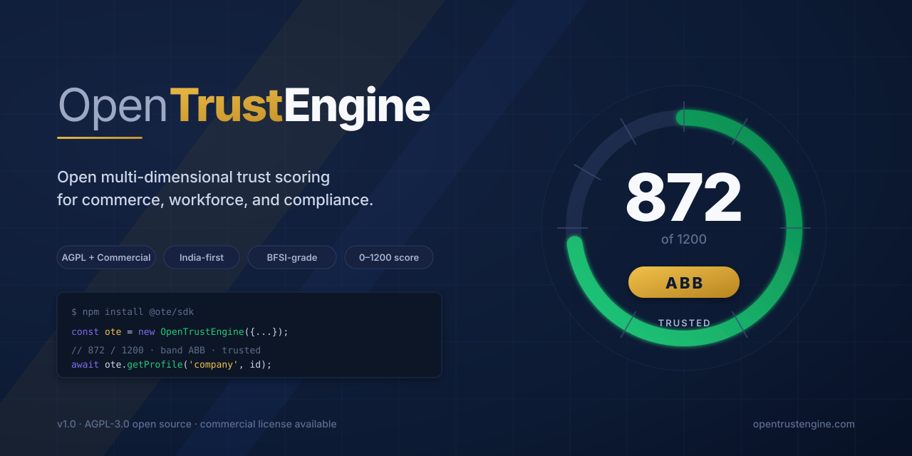
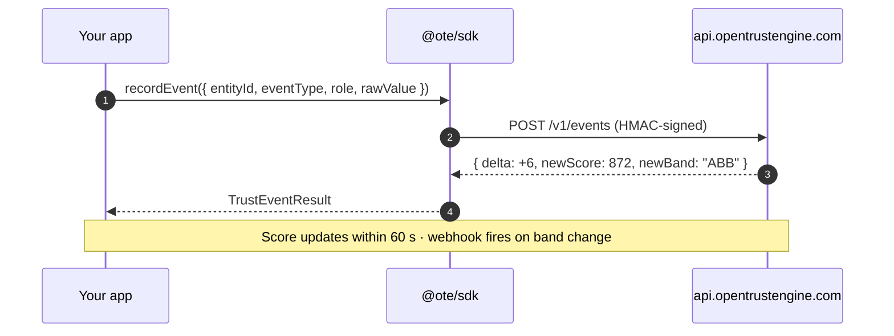
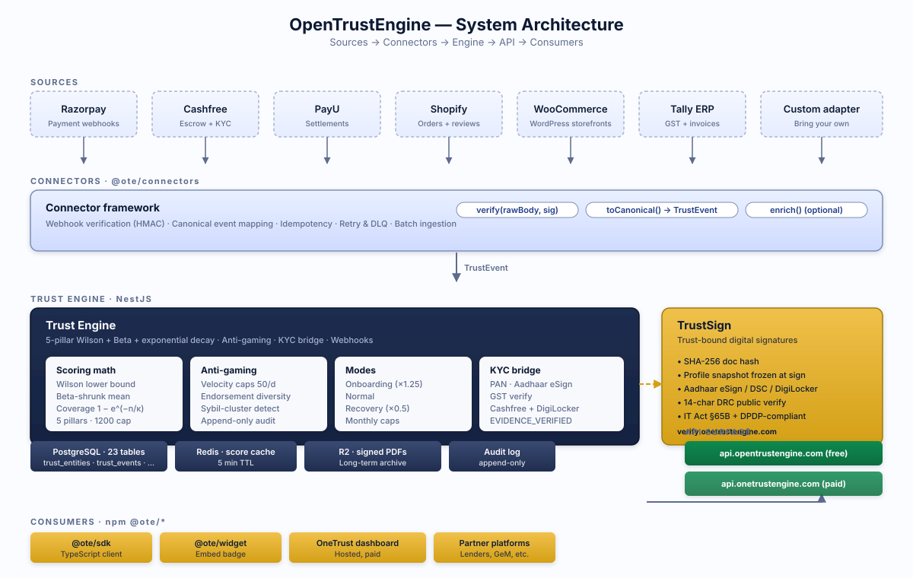

<div align="center">

<picture>
  <source media="(prefers-color-scheme: dark)" srcset="docs/hero.svg">
  
</picture>

<br>

[](https://www.npmjs.com/package/@ote/sdk)
[](https://github.com/deepakfq/opentrustengine/actions)
[](LICENSE)
[](https://github.com/deepakfq/opentrustengine/stargazers)
[](https://bundlephobia.com/package/@ote/sdk)
[](https://opentrustengine.com)

<h3>Open trust scoring infrastructure for commercial reputation.</h3>

<p>
Replaces fragmented credit + platform reputations with a single, explainable
<strong>0–1200 score</strong> computed from real signals — payments, deliveries, disputes, reviews, KYC, accounting filings.<br>
Built for lenders, marketplaces, government tenders, and B2B SaaS in <strong>India and emerging markets</strong>, where Plaid and FICO don't reach.
</p>

<sub>· <a href="#-quick-start">Quick start</a> · <a href="#-architecture">Architecture</a> · <a href="#-comparison">Comparison</a> · <a href="#-use-cases">Use cases</a> · <a href="#-roadmap">Roadmap</a> · <a href="LICENSE-COMMERCIAL.md">Commercial</a> ·</sub>

</div>

---

## ⚡ Quick start

```bash
npm install @ote/sdk
```

```ts
import { OpenTrustEngine } from '@ote/sdk';

const ote = new OpenTrustEngine({
  apiKey: process.env.OTE_API_KEY!,
  apiSecret: process.env.OTE_API_SECRET!,
});

// 1. Record a positive event
await ote.recordEvent({
  entityType: 'company',
  entityId: 'b1f2…',
  eventType: 'ESCROW_RELEASED',
  role: 'seller',
  rawValue: 5000,
});

// 2. Read the trust profile
const profile = await ote.getProfile('company', 'b1f2…');
//      ^? { company_score: 872, company_band: 'ABB', pillars: [...], ... }
```



➡ **Get a free API key** at [opentrustengine.com](https://opentrustengine.com) (no credit card).

[See full SDK docs →](packages/trust-sdk/README.md) · [Embed the badge widget →](packages/trust-widget/README.md) · [Connect Razorpay/Cashfree/Tally →](packages/trust-connectors/README.md)

---

## 🏛 Architecture

<picture>
  <source media="(prefers-color-scheme: dark)" srcset="docs/architecture-dark.svg">
  
</picture>

The engine reads payments, deliveries, GST filings, reviews, and KYC events from any source via the **connector framework**, runs them through a **5-pillar Wilson + Beta + decay** scoring model, and exposes the result through a **public REST API + SDKs + an embeddable widget**.

The math is intentionally **conservative**: small samples produce small scores (so cold-start entities cannot game the system), large samples drift toward their underlying quality.

| Pillar | Cap | Signals |
|---|---:|---|
| Transaction discipline | 400 | On-time dispatch, fulfilment SLA |
| Payment reliability | 300 | Escrow funding, on-time release, late % |
| Consistency & volume | 250 | Frequency, log-scaled value, partner breadth |
| Dispute resolution | 150 | Dispute rate, liable party, resolution speed |
| Peer feedback | 100 | Verified reviews & endorsements quality |
| **Total** | **1200** | |

Score ↔ band mapping (triple-letter, descending):

| Band | ≥ Score | Tier | Band | ≥ Score | Tier |
|---|---:|---|---|---:|---|
| **AAA** | 1100 | Elite | **BBC** | 500 | Building |
| **AAB** | 1000 | Premier | **BCC** | 300 | Growing |
| **ABB** | 900 | Trusted | **CCC** | 100 | Starting |
| **BBB** | 700 | Reliable | **DDD** | 0 | New |

A composite **Overall Trust Score (OTS)** combines four sub-scores (work in progress, see [Roadmap](#-roadmap)):

```
OTS = 1200 · ( 0.55·BTS̃ + 0.15·WTS̃ + 0.10·CTS̃ + 0.20·ITS̃ )
```

where `BTS` is business, `WTS` workforce, `CTS` compliance, `ITS` individual. The tilde `~` denotes range-normalisation.

---

## 🔍 Comparison

How OpenTrustEngine compares to existing reputation and credit scoring systems:

| Capability | OpenTrustEngine | FICO SBSS | eBay Feedback | Lenddo | Tala | Schufa |
|---|:---:|:---:|:---:|:---:|:---:|:---:|
| Score range | 0–1200 | 0–300 | 0–100 % | 0–1000 | 300–850 | 100–600 |
| Multi-dimensional (BTS+WTS+CTS+ITS) | ✓ | ✗ | ✗ | partial | ✗ | ✗ |
| Real-time updates (≤ 60 s) | ✓ | ✗ | ✓ | partial | ✓ | ✗ |
| Open public REST API + SDK | ✓ | ✗ | ✗ | ✗ | ✗ | ✗ |
| **Open source** | ✓ AGPL | ✗ | ✗ | ✗ | ✗ | ✗ |
| **Self-hostable** | ✓ | ✗ | ✗ | ✗ | ✗ | ✗ |
| Per-pillar explainability | ✓ | partial | ✗ | ✗ | ✗ | partial |
| Trust-bound digital signing | ✓ | ✗ | ✗ | ✗ | ✗ | ✗ |
| India / emerging markets focus | ✓ | ✗ | n/a | ✓ | ✓ | ✗ |
| Coverage of small businesses | ✓ | partial | ✗ | individual only | individual only | individual only |

We're aware of newer alt-credit and identity providers (Sardine, Trulioo, Persona, Karza, Setu) and similar Indian fintech tooling. None of them are open source, none expose pillar-level explainability, and none bind a frozen trust snapshot into a legally-valid e-signature.

---

## 💼 Use cases

### Lender (NBFC / co-op bank)

```ts
const profile = await ote.getProfile('company', borrowerId);
if (profile.company_score >= 700 && profile.company_band !== 'DDD') {
  approveLoan(borrowerId, computeRate(profile));   // ABB+ gets prime rate
}
```

Underwriters read `BTS + CTS` before approving a loan. Replaces ₹50,000 manual underwriting with a ₹500 API call. Loan-decision SLA from 7 days to 5 minutes.

### Marketplace onboarding

```ts
const verify = await ote.verify('company', sellerId);
if (verify.verified && verify.band <= 'BBB') {
  fastTrackSeller(sellerId);     // skip manual KYC review
}
```

New sellers connect Razorpay + Tally during onboarding. OTE returns a band; marketplace skips manual KYC for sellers in `BBB+`. Drops onboarding from 7 days to 5 minutes for trusted sellers.

### Government tender (GeM, IREPS) — TrustSign

A bidder submits a single TrustSign-signed credential as proof of past performance — the verifier reads the signer's frozen trust profile from the document via DRC. Eliminates the 30-page document submission per tender.

### B2B SaaS (Tally, Zoho, etc.)

Embed `@ote/widget` in customer dashboards, deepen retention by exposing trust-score visibility. Co-marketing channel + sticky differentiator.

---

## 🛡 Why dual-license?

> OpenTrustEngine is **AGPL-3.0** for the open community and **commercially licensed** for closed-source / SaaS deployments without source disclosure.
>
> - **Building on top of our hosted API** at `api.opentrustengine.com`? No commercial licence needed — the SDK is a network client.
> - **Forking the engine and self-hosting internally**? AGPL is sufficient.
> - **Embedding in a closed-source product** or hosting modified code as a SaaS? Get a [commercial licence →](LICENSE-COMMERCIAL.md)
>
> This is the same model used by **MongoDB, Elastic, Sentry, and Grafana**.

---

## 🗺 Roadmap

### Q2 2026 — open source launch (we are here)
- [x] Public REST API on `api.opentrustengine.com`
- [x] `@ote/sdk`, `@ote/widget`, `@ote/connectors` published
- [x] 6 connectors: Razorpay, Cashfree, PayU, Shopify, WooCommerce, Tally
- [x] TrustSign — Aadhaar eSign + DRC public verification (`verify.onetrustengine.com`)
- [x] AGPL + Commercial dual-license
- [ ] Self-hostable Docker image with one-command bring-up
- [ ] Self-serve dashboard at `onetrustengine.com`

### Q3 2026 — multi-dimensional scoring
- [ ] WTS — Workforce Trust Score (0–600)
- [ ] CTS — Compliance Trust Score (0–400)
- [ ] ITS — Individual Trust Score (0–600)
- [ ] OTS composite formula in scoring orchestrator
- [ ] React Native / Kotlin / Swift SDKs

### Q4 2026 — verifiable credentials
- [ ] W3C VC issuance for trust profiles
- [ ] ZK-proof predicate verification (`score ≥ τ` without revealing exact score)
- [ ] RBI account-aggregator framework integration
- [ ] Research paper submission (IEEE TIFS / Computers & Security)

### Beyond
- [ ] Government tender pre-qualification module (GeM, IREPS)
- [ ] Cross-platform identity stitching with provable Sybil resistance
- [ ] Insurance pricing API (trade credit, performance bonds)

---

## 📦 Packages

| Package | Description |
|---|---|
| [`@ote/sdk`](packages/trust-sdk) | TypeScript / JavaScript client for the OTE REST API |
| [`@ote/widget`](packages/trust-widget) | Embeddable trust badge widget — drop a `<script>` on any site |
| [`@ote/connectors`](packages/trust-connectors) | Connector framework — Razorpay · Cashfree · PayU · Shopify · WooCommerce · Tally |
| [`@ote/shopify`](plugins/opentrustengine-shopify) | Shopify app for automatic seller scoring |
| [`@ote/tally-agent`](plugins/opentrustengine-tally) | Electron desktop agent — sync Tally ERP into OTE |
| [`opentrustengine-woocommerce`](plugins/opentrustengine-woocommerce) | WordPress / WooCommerce plugin |

---

## 🚀 Examples

| Example | What it shows |
|---|---|
| [`examples/basic-usage`](examples/basic-usage) | Record an event, read a profile, log result — 20 LOC |
| [`examples/next-app`](examples/next-app) | Next.js page with `@ote/widget` embedded |
| [`examples/webhook-server`](examples/webhook-server) | Express server receiving Razorpay webhooks via `@ote/connectors` |

---

## 🤝 Contributing

PRs welcome. By contributing you agree to the **CLA** in [CONTRIBUTING.md](CONTRIBUTING.md), which dual-licenses your contribution under AGPL-3.0 and the commercial license.

This is standard for projects with a commercial offering (MongoDB, Elastic, Sentry, Grafana, MariaDB, Tailscale).

---

## 📜 License

OpenTrustEngine is **dual-licensed**:

- **[AGPL-3.0-or-later](LICENSE)** — free for open-source, internal, research, and AGPL-compliant SaaS use.
- **[Commercial license](LICENSE-COMMERCIAL.md)** — required for closed-source distribution or SaaS without source disclosure. Contact **deepak@freaquer.com**.

If you call our hosted API at `api.opentrustengine.com` from your application via the SDK, you do **not** need a commercial license — the SDK is a network client.

Copyright © 2026 **Deepak Kumar Dwivedi, Freaquer**.
